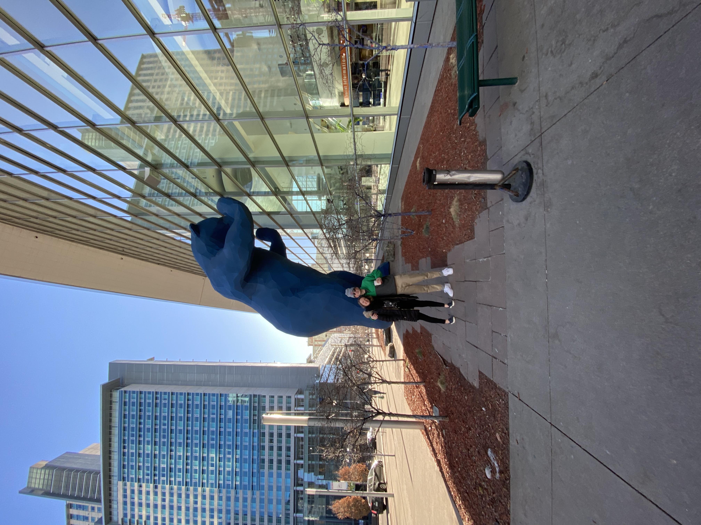
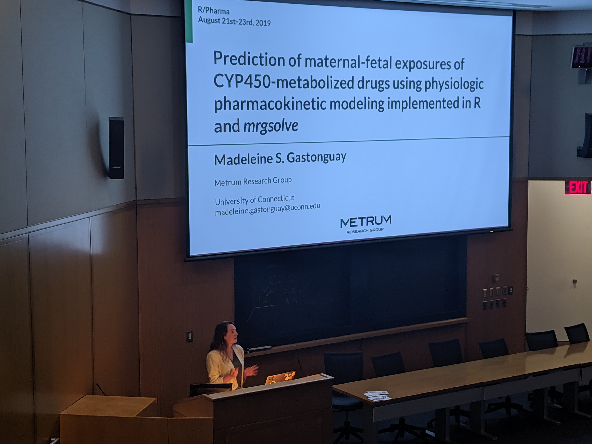
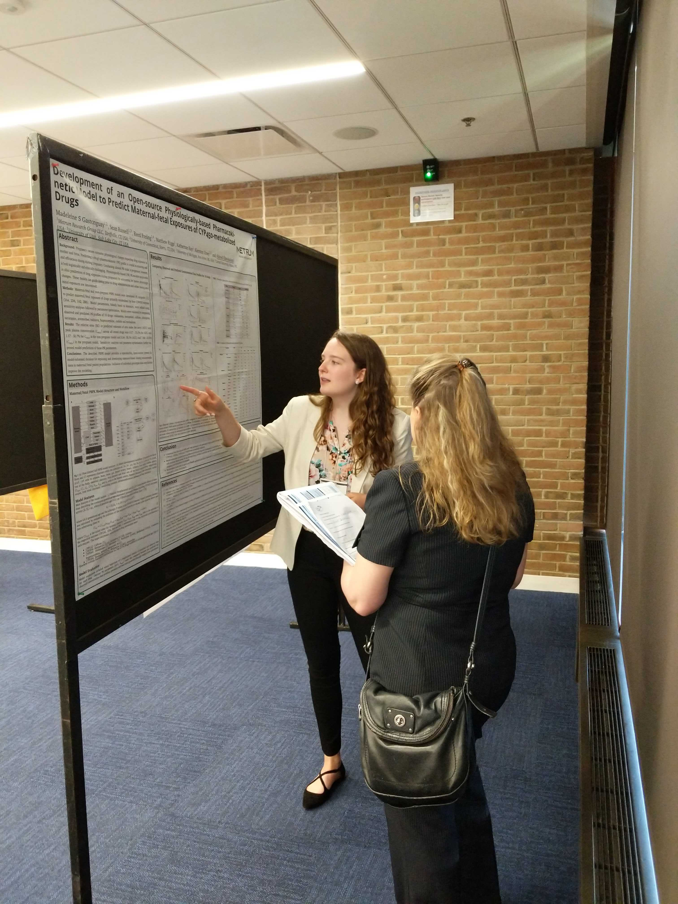

# Presentations

### Joint Meeting in Mathematics 2020

Outside the Denver convention center getting some moral support from my brother.

### R/Pharma August 2019

Presenting work from my summer internship with Metrum Research Group at R/Pharma in Cambridge, MA.

### International Society of Pharmacometrics Regional QSP Day July 2019

Presenting a poster from my summer internship with Metrum Research Group at IsOP regional QSP day.

### UConn Frontiers April 2019

Presenting a poster from my summer internship with Metrum Research Group at UConn's spring frontier poster session.

# Acadia National Park

Catch of the day!

The summit of Pemetic mountain.

Kayaking with seals on Somes Sound.
